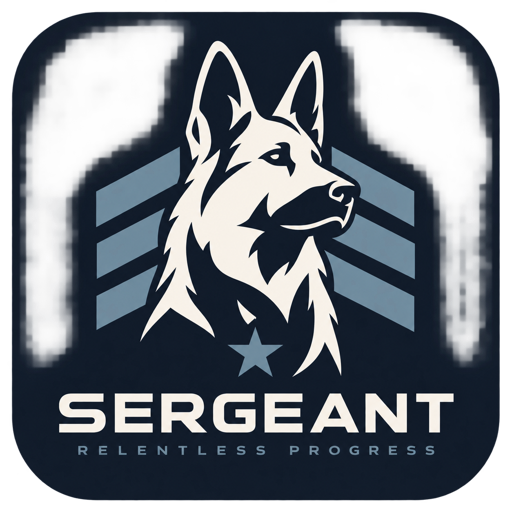

# Sergeant



Sergeant supervises AI engineering work. A Linear issue delegated to Sergeant becomes merged code
or a clear question back on the issue, without a human driving each step: Sergeant's reasoning
reads the issue, GitHub, and run state; briefs one primary worker to do the engineering; starts a
separate fresh-context reviewer when the change warrants it; asks a human only for genuine
judgment; and merges through a deterministic Gate.

This is Sergeant 2, a TypeScript workspace (pnpm, Turborepo, oxlint, Vitest). It is currently a
walking skeleton:

| Package | What it is |
|---|---|
| `packages/contracts` (`@terros/sergeant-contracts`) | Zod schemas for the conversation, Situation Report, run reports, proposed actions, and PR facts; the ports adapters implement; the pure merge Gate |
| `packages/reasoning` (`@terros/sergeant-reasoning`) | One fresh-context reasoning turn through the local `claude` CLI: Situation Report in, validated proposed actions out |
| `packages/linear`, `packages/github` (`@terros/sergeant-linear`, `-github`) | Live Linear and GitHub adapters (UNF-704), and GitHub App installation tokens for the control-plane and worker Apps (UNF-720) |
| `packages/runner` (`@terros/sergeant-runner`) | Local primary worker and fresh-context reviewer (UNF-705) |
| `packages/sergeant` (`@terros/sergeant`) | The app: executes proposed actions through the Gate against the ports, and the polling loop for one explicitly selected, V2-delegated issue that files follow-up issues, can ask a human and wait for the reply, posts one outcome comment after the merge, records review telemetry and audits a sample of skipped reviews, and stays within a task budget (UNF-706, UNF-724, UNF-727, UNF-728, UNF-729, UNF-730); and the long-running service that runs that loop for every delegated issue (UNF-719) |

The architecture is designed in pseudocode in [`docs/design/`](docs/design/README.md) (draft 3).
Code here implements only the parts a ticket asks for. [`AGENTS.md`](AGENTS.md) is the guide for
agents and contributors.

## Commands

Requires Node.js 24 LTS (`.nvmrc`) and pnpm (pinned via `packageManager`;
`corepack enable`). Run from the repository root:

```sh
pnpm install     # install dependencies
pnpm exec turbo boundaries   # one-way package dependencies
pnpm lint        # turbo run lint      (oxlint)
pnpm typecheck   # turbo run typecheck (tsc, strict)
pnpm test        # turbo run test      (vitest)
```

The live commands below are manual and never run from tests or CI. They take an installation
config file that holds identifiers and secret references only (AWS Secrets Manager ids, resolved
with the configured AWS profile and region); no credential is ever printed, and no ambient `gh`,
Linear, or Claude login is used. Its shape is `InstallationConfig` in
`packages/sergeant/src/config.ts`:

```json
{
  "secrets": { "awsRegion": "us-west-2", "awsProfile": "<profile>" },
  "linear": { "tokenSecret": "<V2 Linear agent token secret id>", "agentUserId": "<V2 agent user id>" },
  "github": {
    "controlPlaneApp": { "appId": 1, "installationId": 2, "privateKeySecret": "<secret id>" },
    "workerApp": { "appId": 3, "installationId": 4, "privateKeySecret": "<secret id>" }
  },
  "repositories": { "owner/name": { "mergeMethod": "squash" } },
  "modelTokenSecret": "<Sergeant model token secret id>",
  "gitIdentity": { "name": "<human name>", "email": "<human email>" }
}
```

The Linear token must act as `agentUserId` (checked at startup); every Linear read and write uses it.
Optional `linear.otherAgentUserIds` lists other agents' users (V1's) whose comments are not human
input. Optional `review.auditSampleRate` (0 to 1, default 0.2) is the fraction of merged heads that
skipped fresh review which get an audit review.

The control-plane App reads PRs, checks, and branch rules, and approves then merges; it needs
contents and pull requests write, checks and commit statuses read, and metadata read. The worker App
needs contents and pull requests write, and checks and actions read. Neither may hold administration,
workflows, secrets, environments, deployments, or actions write, and the worker App must not be a
ruleset bypass actor. Contents write would let the worker App merge its own green PR, so each
repository's ruleset must require at least one approving review: GitHub never lets a PR's author
approve it, and the control-plane App submits that approval on the exact gated head only after every
Gate check passes, immediately before its SHA-guarded merge. A failed approval stops the merge.
Only the base branch's declared required checks count toward a merge (ruleset
`required_status_checks`), so a repository with none cannot be merged; a repository's
`"observedChecksFallback": true` instead treats every check observed on the exact head as required.

After the V2 identities and the repository ruleset are provisioned (UNF-720), the live check
confirms them without writing anything or spending model money, and fails if the base branch does
not require an approving review:

```sh
pnpm --filter @terros/sergeant live-check --config <file> --repo owner/name [--issue UNF-123] [--pr 45]
```

The canary loop reads and writes live Linear and GitHub, launches real model sessions, and costs
money. It works on the issue only while the issue is delegated to `agentUserId`: before anything
starts, on every poll, and again from a live read before each start, merge, and the outcome comment
(Gate rule A1). An undelegated or reassigned issue stops the loop, cancels its running runs, and
gets no merge and no comment. Undelegation is the human's cancel: the loop keeps retrying each
cancellation, and treats a run whose status it cannot read as still running, until the runner confirms
every run stopped. After the merge, the V2 agent posts one outcome comment (PR, reviewed
head, observed required checks, merge result, known gaps), keyed by the issue and the merge so a
rerun never posts it twice; Linear's GitHub integration moves the issue to Done. Workers push their branches and open PRs with a worker-App token scoped to their run's
repositories; the merge is one control-plane action: fresh exact-head PR, check, and Linear reads,
the Gate, and GitHub's SHA-guarded merge. A blocking review finding or a failed required check
wakes a turn that may start a successor worker (one at a time, R1) on the same PR; its brief carries
the PRs with their check states and every earlier run's report and findings. The fix is a new head,
so the merge again needs a fresh approving review of it or the worker's waiver for it (M6); the
loop's `maxTurns` bounds the iterations. This runner cannot resume a worker's session, so every
continuation is a successor. Re-running the same command resumes from `<dir>/state.json`.

Reasoning may ask a human (`ask_human`): the V2 agent posts one question comment, keyed by the issue
and the conversation revision it was asked from, and the loop then takes no turn and makes no effect
until a human comments or edits the issue. No timeout decides for the human; `STOP` or undelegation
still ends the loop. The wait is never stored locally: a restart finds the question on the issue.

Workers suggest out-of-scope work in their report's `followups`; reviewers' `non_blocking` findings
are in theirs. Reasoning decides which deserve an issue and proposes `create_followup` with a short
key naming the idea. The V2 agent files it in the task issue's team and project, related to the issue
(or blocked by it), with no delegate or assignee, so humans triage it. Linear's client-supplied ids,
derived from `followup:<task>:<key>`, make it at most one issue and one relation per key, even across
a crash or a rerun; filed follow-ups are kept in `state.json`, shown to every later turn, and listed
in the outcome comment. The Gate allows at most 3 per task (F1). The Linear token needs permission
to create issues and issue relations.

Review quality is telemetry, never a gate (UNF-730, design 06 §8–9). Every reviewer run that
finishes, whether or not the task ever merges, is written as a line of `<dir>/reviews.jsonl`: trigger
(`required` or `audit`), mode (a separate fresh run), reviewer and implementer provider and model,
whether their vendors are the same, the heads reviewed, the verdict, finding counts, the must-fix
(blocking) findings verbatim, the merged head once there is one, and the resulting change
(`resultingMutation`: `true` when a worker's report lists one of its findings `fixed` in
`addressedFindings`, `false` when it had none or workers answered them and fixed none, otherwise
`"unknown"`; a head changing after a review is not counted). A review is written again only when one
of those later facts changes, so the last line per run id holds. A merged head that no fresh review
approved skipped review; a stable hash of the head picks `review.auditSampleRate` of those for an
**audit review**, a separate fresh reviewer of exactly the merged head, started only after the merge
so it can never hold one up. After observing Done the loop waits for any review still running,
the audit included, and records it; an audit's must-fix findings on merged code also go to
`<dir>/audit-followups.jsonl` and an `AUDIT FOLLOW-UP` log line for a human to act on (nothing is
reopened or reverted, and no turn runs after the merge to propose a `create_followup`). To compare
review modes across runs:

```sh
cat <state dirs>/reviews.jsonl | jq -s 'reduce .[] as $f ({}; .[$f.runId] = $f) | [.[]] | group_by([.trigger, .vendor])
  | map({trigger: .[0].trigger, vendor: .[0].vendor, reviews: length, withMustFix: map(select(.findings.blocking > 0)) | length,
    ledToChange: map(select(.resultingMutation == true)) | length, unknown: map(select(.resultingMutation == "unknown")) | length})'
```

Each task has a budget window (`--budget-minutes`, default 120; `--budget-usd`, default 25), saved in
`state.json` with the task's start before anything else happens. A restart keeps the stored window and
logs that it ignores different flags; only a grant extends it. Wall time is hard and runs from the
task's start, including time spent waiting for a human. Spend is best-effort: the cost runs and
reasoning turns report when they end (a turn's cost counts before its proposals run), so a running or
canceled run's cost is unknown and the wall time is the backstop; there is no billing ledger. Once
either is exhausted, no run, message, follow-up, or merge happens (Gate rule B1, checked before every
effect and again right after its live reads), running runs are canceled until the runner confirms it,
and the V2 agent asks one **Question for you**, summarizing spend, runs, and PRs, with the options to
extend or accept as-is. It is posted like any question, under a key of the task and the window, so a
restart finds it on Linear instead of asking again, and nothing happens until a human replies after it.
A reply that reasoning reads as "extend" becomes `grant_budget` citing that comment (K1, K3): one more
window of wall time from the grant and of spend, and nothing else happens in that turn (K4). Any other
reply grants nothing, and the loop ends on its idle guard. The outcome comment after a merge is the one
effect B1 does not hold back: it reports a merge that already happened, and withholding it would hide
the merge from the human. A run's id is saved before the runner starts it, so a crash in between still
leaves a run the loop cancels; one the runner never started is dropped once a cancel confirms it.

```sh
docker build -t sergeant-runner:local packages/runner/container
pnpm --filter @terros/sergeant canary --config <file> --issue UNF-123 --repo owner/name --dir <state dir>
```

### The service

`serve` runs Sergeant unattended (UNF-719): one process that works every open issue delegated to the
V2 agent, in every repository the installation config enrolls, with nobody starting an issue by hand.
It is a thin shell over the canary's per-task loop, not a workflow engine:

- **Intake** lists open (not completed or canceled) issues delegated to `agentUserId` every
  `--intake-seconds` (120) and runs each one's loop, at most `--max-tasks` (2) at a time; the issue
  whose loop ended longest ago gets a free slot first. A task waiting for a human or a run holds its
  slot.
- **Each task loop** is the canary's: every `--poll-seconds` (60) it re-reads its runs, the PRs
  Linear links to the issue or a worker reported, with their checks, and the Linear conversation, and takes a reasoning turn only when they changed, so
  missing webhooks do not matter. Its state is `<state dir>/tasks/<issue>/`; runs live under
  `<state dir>/runs/`.
- A loop that ends (idle, the turn limit, a failed read) is admitted again on a later intake while
  the issue is still delegated: an unchanged task takes no turn, a changed one does. A failed intake
  is logged and retried next interval.
- SIGINT or SIGTERM stops intake and ends each loop at its next poll, never mid-turn; a second signal
  exits at once. A restart rereads Linear, GitHub, the runner, and each task's `state.json`, and
  continues, accepting some repeated work. One process serves a state directory: it holds an OS file lock on
  `<state dir>/service.lock` (released when it exits, however it exits), and a second start is refused while it does. `GET /health` on `--host` (127.0.0.1) and `--port` (8080) reports the process alive,
  the tasks running, and the last intake.

```sh
pnpm --filter @terros/sergeant serve --config <file> --state-dir <dir> [--port 8080] [--max-tasks 2]
```

To run `serve` on one AWS host behind an HTTPS endpoint, see [`deploy/`](deploy/README.md): Terraform,
the host install and update scripts, and the runbook.

### UNF-724 live check (after UNF-720)

Once the V2 Linear agent app, both GitHub Apps, and the canary repository's ruleset exist:

1. Put the V2 agent's Linear user id in `linear.agentUserId` and V1's agent user in
   `linear.otherAgentUserIds`.
2. Create a small controlled issue in the canary repository's team and delegate it to the V2 agent.
   `live-check --issue <it>` must pass, including `issue is delegated to the V2 agent`.
3. Undelegated or delegated to V1's agent, `canary --issue <it>` stops at once with
   `CANARY RESULT {"outcome":"stopped",...}` and nothing is started; V1 never sees an issue delegated
   to V2.
4. Delegated to the V2 agent, run `canary` through to the merge. Expect exactly one comment, authored by
   the V2 agent, with the PR link, reviewed head, required checks, merge SHA, and known gaps, then the
   issue moving to Done through the GitHub integration (`CANARY RESULT {"outcome":"done",...}`).
   Running the same command again posts nothing more.
5. On a second controlled issue, reassign it to V1's agent (or remove the delegate) while a turn is
   deciding or a worker is running: the loop stops, cancels the running run, merges nothing, and
   posts nothing.

### UNF-726 live check (after UNF-720)

With the identities from UNF-720, on a controlled issue in the canary repository whose objective
invites a fixable mistake (or after a human pushes a deliberately failing commit to the worker's PR):

1. Run `canary` until a reviewer returns `changes_requested` with a blocking finding, or a required
   check fails on the PR head. The next turn starts one successor worker; its
   `<dir>/runs/<runId>/workspace/sergeant-brief.md` lists the PR, the failing check, and the finding.
2. The successor pushes to the same PR (no second PR, no second worker running), and the loop merges
   only after a fresh approving review of the new head, or the successor's own waiver for that exact
   head, with required checks green (`CANARY RESULT {"outcome":"done",...}`).

### UNF-727 live check (after UNF-720)

On a controlled issue delegated to the V2 agent whose description leaves a real product choice open
(for example "retain or purge X; the captain decides"):

1. Run `canary`. Expect one comment from the V2 agent headed **Question for you**, then only
   `waiting:` log lines: no run started, no merge, and no `idle` stop.
2. Stop the loop (`touch <dir>/STOP`), remove `STOP`, and run it again: still exactly one question
   comment, and it keeps waiting.
3. Reply on the issue in your own words. The next poll takes a turn that interprets the reply and
   continues the work (or asks one short clarifying question, which waits the same way).

### UNF-729 live check (after UNF-720)

With the identities from UNF-720, on a controlled issue in the canary repository whose change invites
a minor, out-of-scope observation:

1. Run `canary` until a reviewer approves with a `non_blocking` finding, or the worker's report lists
   a `followups` entry. In the turn that merges (or earlier), `turns.jsonl` shows a
   `create_followup <key>: done {"identifier":...}` outcome.
2. In Linear, exactly one new issue exists for it: in the origin issue's team and project, with no
   delegate or assignee, a description that stands alone and links back, and a `related` (or
   blocked-by) relation to the origin. The outcome comment lists it under "Follow-ups filed".
3. Rerun the same command, and once more with `state.json` restored from before that turn: no second
   issue or relation appears.

### UNF-730 live check (after UNF-720)

With the identities from UNF-720 and `"review": { "auditSampleRate": 1 }` in the installation config,
on a controlled issue in the canary repository whose change is small enough that the worker skips
review (a one-line docs fix, say):

1. Run `canary` through the merge. The worker's report says `review.required: false` with a reason,
   and the merge relies on it (`not_required`).
2. After the outcome comment, the log shows `audit review run_audit-<head> started`, and the loop
   waits for it after the issue reaches Done. Its brief
   (`<dir>/runs/run_audit-<head>/workspace/sergeant-brief.md`) names the merged head and the skip reason.
3. `<dir>/reviews.jsonl` ends with one `"trigger":"audit"` line for it; any blocking finding is also in
   `<dir>/audit-followups.jsonl` and an `AUDIT FOLLOW-UP` log line. `CANARY RESULT` stays `"done"`.
4. With `auditSampleRate` 0, or on an issue whose head a fresh review approved, no audit starts, and
   the last `reviews.jsonl` line of each reviewer run is `"trigger":"required"` with `merged` set.
5. On an issue whose first review requests changes, the successor's report lists the finding in
   `addressedFindings`, and that review's last line says `"resultingMutation":true`.

### UNF-728 live check (after UNF-720)

On a controlled issue delegated to the V2 agent whose work takes more than a few minutes:

1. Run `canary --budget-minutes 5`. Once a worker is running and five minutes have passed, expect
   `budget exhausted (wall time exhausted at ...)` and `canceled run_...` log lines, `docker ps` showing
   no `sergeant-run_*` container, and one **Question for you** comment from the V2 agent with the spend,
   the runs (the worker `canceled`), any PR, and the extend / accept-as-is options. No run starts and
   nothing merges while it waits.
2. Reply "extend". The next turn logs `grant_budget: done`, and the following one resumes the work in a
   fresh five-minute window. Replying "accept as-is" instead grants nothing; the loop ends `idle`.
3. With `--budget-usd 1`, the first finished run's reported cost exhausts the spend instead
   (`spent $... of $1.00`), with the same question.
4. On another issue, undelegate it while a worker runs: the loop logs `canceled run_...` and stops only
   after that; stopping Docker first (or making `docker stop` fail) keeps it retrying, not stopped.
5. Kill the canary (Ctrl-C) while the budget question is unanswered and rerun it with
   `--budget-minutes 120`: it logs `ignoring the budget options`, posts no second question, and still
   waits for the reply.

## Sergeant 1

Sergeant 1, the Rust implementation, has been removed. Its final source, including its runbooks and
architectural decision records, is the annotated tag `v1-final` (`git switch --detach v1-final`), and
its last installable release is `v0.1.0+aad6046`.

## License

Sergeant is open source, licensed under the [Apache License 2.0](LICENSE).

Copyright 2026 Terros Inc.

## Support

For contributions, see [CONTRIBUTING.md](CONTRIBUTING.md). To report a security vulnerability, see
[SECURITY.md](SECURITY.md).
