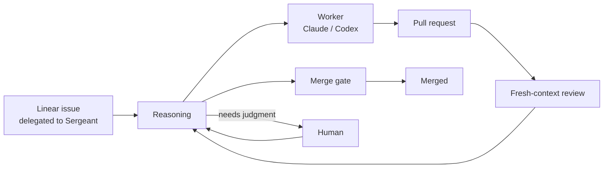

# Sergeant


Sergeant does engineering work you delegate to it in Linear. Assign an issue to yourself, delegate it
to Sergeant, and it comes back as a merged pull request, or as a clear question on the issue when only
a human can decide. Nobody has to drive each step.

## How Sergeant works



- **Reasoning** reads the current state of the issue, its pull requests, and its runs, and decides what
  should happen next.
- **Workers** do the engineering in isolated runs, on Claude Code or Codex, using your own registered
  model account. A worker opens or updates a pull request.
- **Reviewers** start with fresh context, so they judge the change rather than the worker's reasoning.
  Their findings go back to reasoning, which can start another worker to fix them.
- **The merge gate** is deterministic: it refuses a merge that is unreviewed, red on required checks,
  or no longer what was approved.
- **Humans** are asked only for genuine judgment, with a **Question for you** comment on the issue. In
  repositories configured for human merges, Sergeant gets the pull request ready and you merge it.

Each task has a time and spend budget. When it runs out, Sergeant stops and asks whether to extend it.
The design is in [`docs/design/`](docs/design/README.md).

## Getting started

You need a Linear account in a team your installation admits, your installation's URL, and a Claude
or ChatGPT (Codex) subscription for your work to run on.

1. Install `sgt` and sign in with Linear.
2. Register your model account: `sgt account register claude` (or `codex`).
3. In Linear, assign an issue to yourself, delegate it to Sergeant, and move it to Todo.

[**User onboarding**](docs/onboarding-user.md) walks through each step and explains what happens
next. Then see:

- [`sgt` CLI](docs/sgt.md): tasks, runs, accounts, repositories, and administration commands.
- [Sergeant in your AI assistant](docs/sgt.md#9-sergeant-in-your-ai-assistant-sgt-mcp): `sgt-mcp`
  gives MCP-compatible assistants read-only access to Sergeant's tasks and runs.

## Administration

- [Admin onboarding](docs/onboarding-admin.md): admitting users, enrolling repositories and choosing
  who merges in them, and offboarding.
- [Deployment & operations](deploy/README.md): hosting Sergeant, the installation config, GitHub Apps
  and Linear setup, updates, and the reference for how the service behaves.

## Documentation

| Document | What it covers |
|---|---|
| [User onboarding](docs/onboarding-user.md) | From nothing to your first delegated issue |
| [Admin onboarding](docs/onboarding-admin.md) | What approvers and operators do for a new user |
| [`sgt` CLI and MCP](docs/sgt.md) | Installing and using `sgt`, model accounts, and `sgt-mcp` |
| [Architecture](docs/design/README.md) | Design documents: reasoning, the merge gate, runners, review, and the Linear and GitHub contracts |
| [Deployment & operations](deploy/README.md) | Hosting runbook, installation config, and service reference |
| [Runner](packages/runner/README.md) | How worker and reviewer runs execute, and the credentials they get |
| [Security](SECURITY.md) | Reporting a vulnerability; the security model is in [`docs/design/09-security.md`](docs/design/09-security.md) |
| [Contributing](CONTRIBUTING.md) | Building, testing, repository layout, and opening a pull request |
| [Agent guide](AGENTS.md) | Working rules for agents and contributors changing Sergeant |

## Contributing

Sergeant is a TypeScript workspace. It needs Node.js 24 (`.nvmrc`) and pnpm (`corepack enable`):

```sh
pnpm install
pnpm exec turbo boundaries && pnpm exec turbo run lint typecheck test   # what CI runs
```

Read [CONTRIBUTING.md](CONTRIBUTING.md) before opening a pull request, and [AGENTS.md](AGENTS.md) for
the project's working rules.

## License

Sergeant is open source, licensed under the [Apache License 2.0](LICENSE).

Copyright 2026 Terros Inc.
